<h1 align="center">Hi 👋, I'm Mouaddine Adam</h1>

  <em>Full-Stack Developer | Passionate about clean code, scalability, and great user experiences.</em>

---

## 🚀 About Me

- 👨‍💻 Currently working as a **Full-Stack Developer** with **Ruby on Rails** and **Angular**  
- 🌍 Based in **Casablanca, Morocco**
- 🧠 Exploring system design, scalable architecture, and DevOps practices
- 💬 Ask me about web apps, API design, or mobile development
- 📫 How to reach me: [LinkedIn](https://www.linkedin.com/in/your-profile) • [Email](mailto:your.email@example.com)

---

## 🛠️ Tech Stack

### 💻 Frontend

### 📱 Mobile

### ⚙️ Backend

### 🗄️ Databases

### ☁️ DevOps & Tools

### 🧪 Testing

### 🎨 Design & UX

---

## 📈 GitHub Stats

  
  

---

## 🧠 Currently Learning

- Microservices architecture with Kafka and Go
- Advanced AWS services (Lambda, SQS, CloudFormation)
- Performance optimization in frontend frameworks

---

## 🤝 Let's Connect

  
  

---
